# Rocket Show Startup Guide by DavidOpgh
Version 2.0.20240605

Installing Rocket Show on a Pi isn’t difficult but there are some important steps you need to know.  
I wrote this guide so you could benefit from all my efforts to get you up and running quickly.  
Note: At first glance this guide might look long and difficult, but it’s just very comprehensive. I’ll walk you through all the steps.

## Installing Rocket Show on a Pi

### Plug all your devices into the Pi (see Appendix A for a list of my devices)

At a minimum to get started you will need a usb audio device, usb keyboard/mouse, a wired network connection to your home internet, and a monitor as the console terminal.  
If you’re planning on controlling DMX lights you’ll also need a USB DMX interface and DMX lights.

### Download the proper version of Rocket Show for your Pi from the Rocketshow.Net website and unzip the image to your PC
For Pi5  
[https://rocketshow.net/install/images/latest.php](https://rocketshow.net/install/images/latest.php)

Note: There isn’t a latest image for all Pi models, only for the newest model (currently the PI 5)  
For Pi4 and Pi3 you need to install the last version available for that model and then from inside Rocket Show you’re able to update to the latest version.

### Download and Install Raspberry Pi Imager (currently Version 1.8.5) on your PC
[https://www.raspberrypi.com/software/](https://www.raspberrypi.com/software/)

### Insert microUSB card into your PC
I like this brand of microUSB cards, they have a Speed Class of C10, V30, and U3(4). Anything slower than this class is noticeably slower.  
[SanDisk Extreme microSDHC UHS-3](https://www.amazon.com/SanDisk-Extreme-microSDHC-UHS-3-SDSQXAF-032G-GN6MA/dp/B06XWMQ81P)

### Run Raspberry Pi Imager

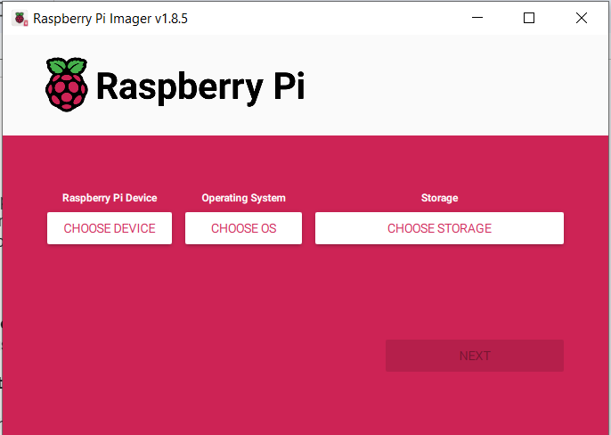

### Click “Choose Device” button and select your model

### Click "Choose OS" button
Scroll to the bottom and select the "Use custom" option  
Navigate to the location on your PC where you unzipped the Rocket Show image file and select it.

### Click "Choose Storage" button.
Select the microUSB card you inserted into your PC from the previous step.

### Click “Next” button

A window will pop up asking “Would you like to apply OS customisation settings?”  
Click the “Edit Settings” button on the Raspberry Pi Imager

### My settings in the General tab
I set username as rocketshow  
I set password as thisrocks

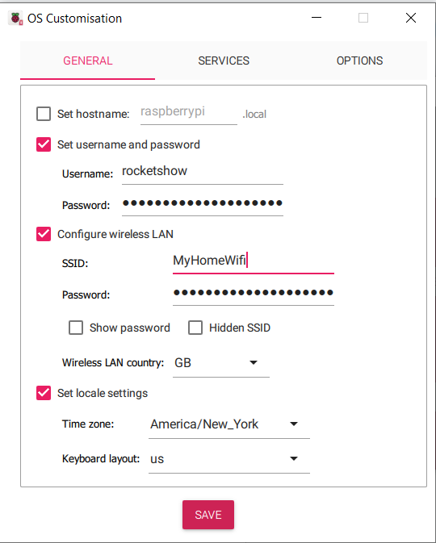

### On the Services tab you can use the defaults or select a preference.
On the Options tab you can use the defaults or select a preference.

### Click "Save" button
A window will pop up asking “Would you like to apply OS customisation settings?”  
Click the “Yes” button  
A window will pop up saying “All existing data on device will be erased. Are you sure you want to continue?”  
Click the “Yes” button to start the writing process

### When completed Windows will pop up windows saying “you need to format the USB memory card before using it” or “Insert Disk”. Just click "Cancel" on any of those windows that pop up.
Raspberry Pi Imager will pop up a window saying you can remove the SD card. Click "Continue"  
Exit Raspberry Pi Imager

### Remove the USB card from the PC and insert it into the Pi

Note: Rocket Show requires a USB audio device to get started, so if you haven’t connected the usb audio device to your Pi yet now would be a good time to do it before booting the Pi (or you’re going to generate an error right away).

### Boot your Pi

Console terminal will pop up a message saying Generating SSH Keys  
Console terminal will pop up a message saying rebooting in 5 seconds  
Pi automatically reboots  
Console terminal will restart and eventually will display the words “Rocket Show” written in ASCII text and list the version number.

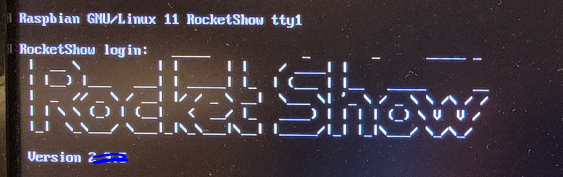

The Console terminal screen will then go blank when Rocket Show has completely finished starting up (this is not an error, this is by design). You can wake up the Console terminal screen by pressing any key on the connected USB keyboard.

## DMX Lighting configuration

If you don’t plan on using DMX lighting you can skip to the next section “Log in remotely to Rocket Show”.  
If you plan on using DMX lighting you need to configure Rocket Show for your USB DMX interface.

### Enable/Disable OLA plugins
/* Appendix B shows what OLA plugins you need to enable/disable depending on your DMX interface */

When you have the correct plugins enabled, reboot the Pi for the changes to take effect.

## Log in remotely to Rocket Show - from your laptop for the 1st time.

To log in remotely to Rocket Show both your laptop and the Pi need to be connected to your home network. After the PI is finished booting use the browser on your laptop and type the address rocketshow.local

Rocket Show will recognize this is the first time you've logged into this new Pi and will ask you for your language.

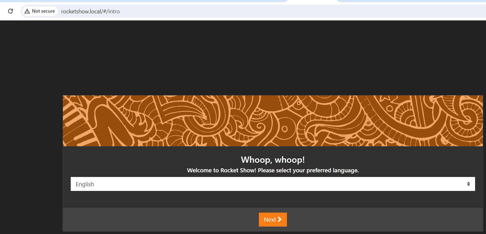

Click Next  
Rocket Show will ask you to name your new Pi. Enter a name for the new PI. I named mine PI 5

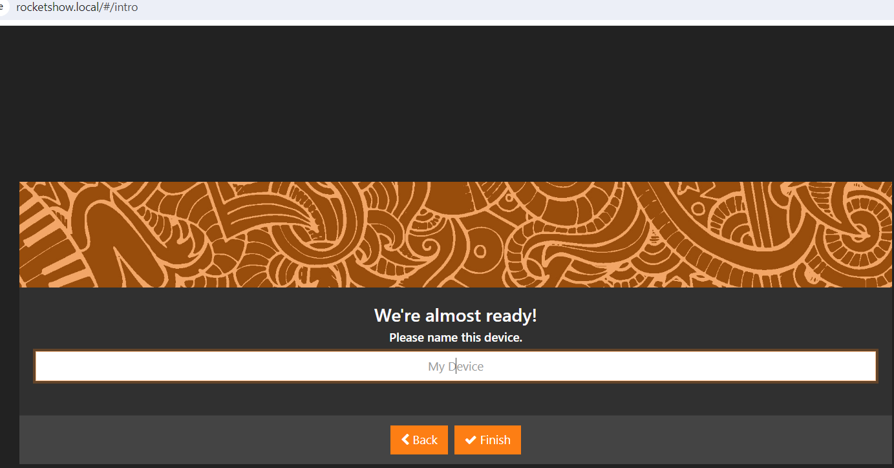

Click Finished  
Don’t skip this next step! (I know at this point you’re excited to play around with Rocket Show but you need to configure the USB audio interface first or you’ll just generate an error)

## Configure the USB Audio Interface

Click on the "Settings" tab at the top of the page.

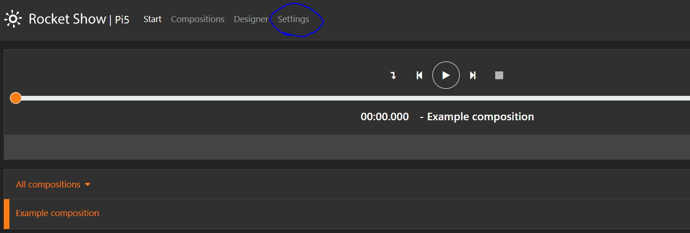

Click on the "Audio" tab on the left side of the page.

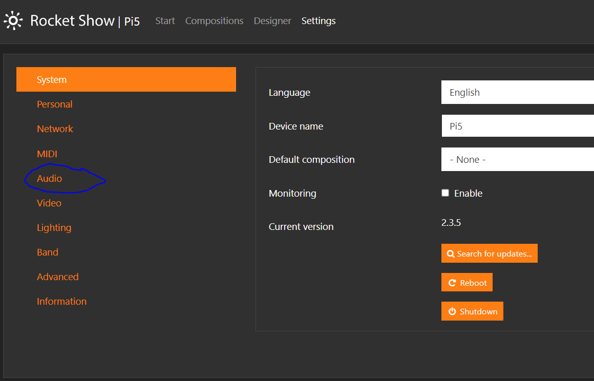

Click on the "Audio device" dropdown and select your audio device. Mine is listed as "USB Audio - USB Audio Device"

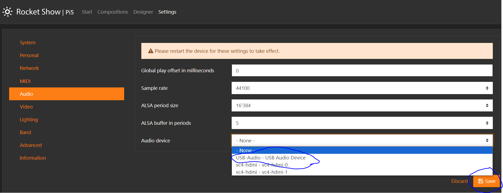

Rocket Show assigns your audio device a default name of My Audio Bus 1. You can change it if you want. I left it as the default.  
Click the "Save" button. Rocket Show will pop up a green window saying the settings have been saved.

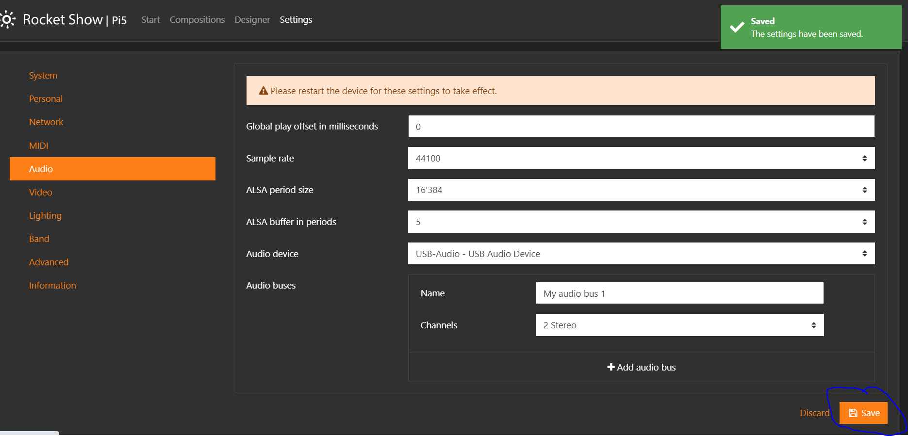

Reboot the Pi for the settings to take effect.  
(Under the Settings tab System tab there is a "Reboot" button you can click or you can cycle the power on your Pi)

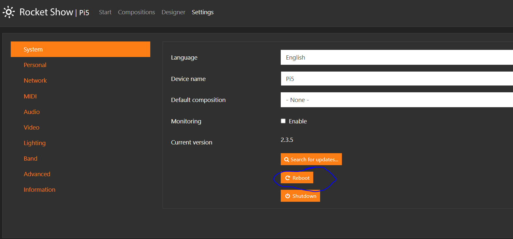

If you click the Reboot button Rocket Show will ask you to confirm Do you really want to reboot the device?  
Click "OK"

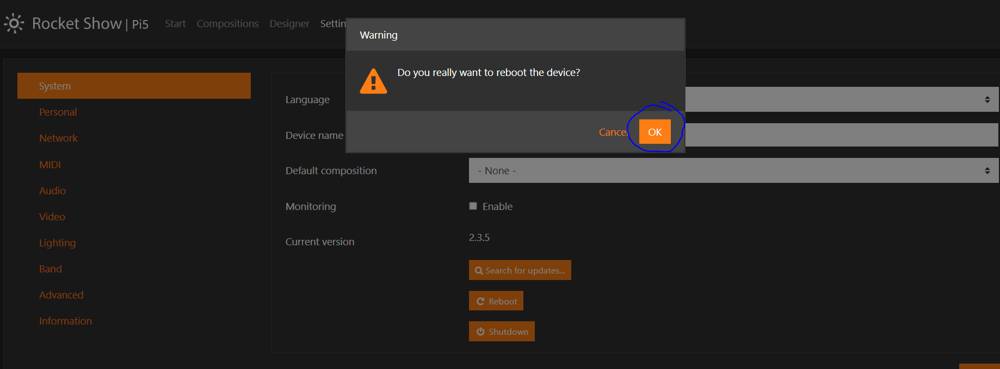

Once Rocket Show starts rebooting you’ll see this in your browser

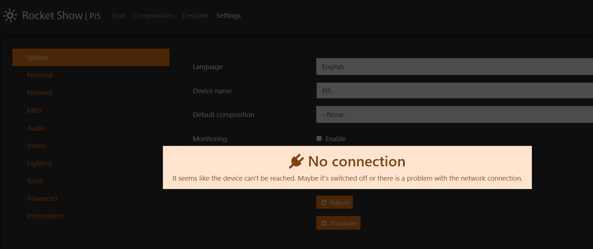

When your Pi has finished rebooting you can just refresh the browser (normally what I do) or you can log in remotely again using rocketshow.local.

### After rebooting, confirm the audio and video are working correctly.
Go to the Start tab and you will see a composition named "Example composition" selected.  
Click the Play button icon in the middle of the screen.

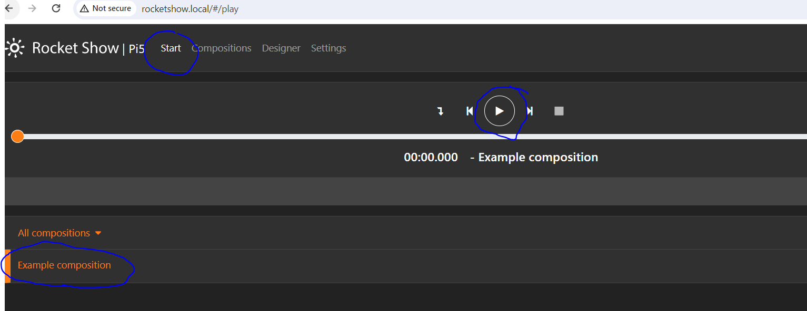

You should hear the music and a click track playing in both stereo channels and see a video of clouds on the terminal console (Note: the video stops after 30 seconds but the audio keeps playing)  
You have now confirmed the audio and video settings are configured correctly

### Confirm the USB DMX interface is connected correctly. (this confirms you have enabled / disabled the correct OLA plugins)
(Using an ENTTEC OPEN DMX USB interface or generic FTDI USB DMX interface)

Go to Settings.Lighting and click on the link "Open lighting console" or open a new tab in your browser using the address rocketshow.local:9090/ola.html

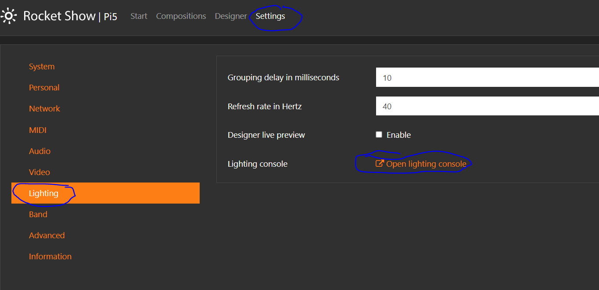

It will open a new "OLA Admin" tab in the browser.  
On the left side expand the "Universes" link. It should display a hyperlink named "Standard"

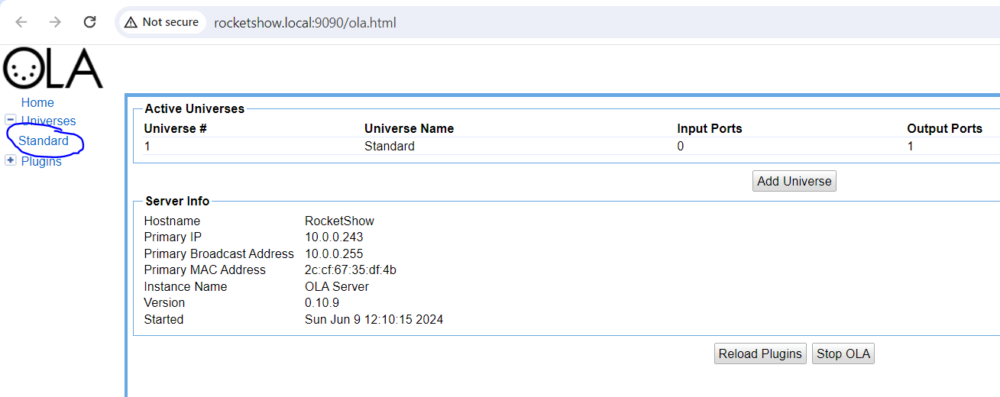

Click on the Standard link which will show you a page for the Standard Universe including Input and Output ports and the Device name  
The Output Ports Device name should say something like "FT232R USB UART with serial number XXXXXXXX"  
(this is dependent on the USB DMX hardware you’re using. This is my hardware) If it says that you have now confirmed OLA sees your FTDI USB DMX interface.

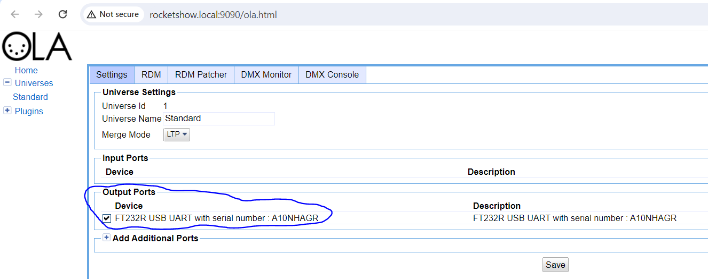

Note: If the Output Ports Device name says something like "StageProfi Device" you forgot to enable/disable the correct plugins.

### Verify you can control your DMX fixtures through OLA
On the "OLA Admin" browser page there is tab named "DMX Console"  
Click on the tab and you'll see a simple 16 channel DMX controller with virtual sliders for each of the 16 channels.  
You can use the arrow keys above the virtual sliders to move the addresses of the channels in blocks of 16.

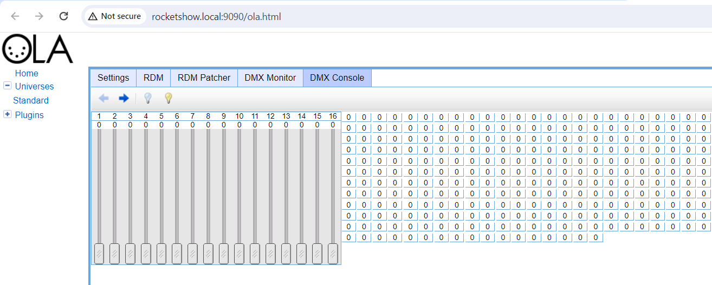

Connect your DMX fixtures to the DMX USB interface.  
Set the address of your DMX fixtures within the 16 channel address range of virtual sliders. In this example the range is Ch1 to Ch16.  
For example - on this simple DMX light I’ve set the address to A001 in the 7 channel mode.

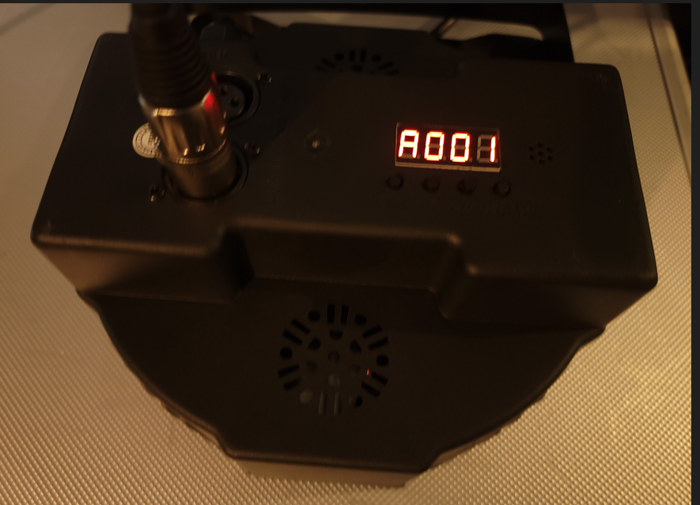

Move the sliders on the page to send DMX information to your DMX fixture.  
The grid of numbers on the right side of the page shows the DMX information being sent on each of the 512 DMX channels.  
If you can control your DMX fixtures from this page then you have confirmed that Rocket Show can control your lights through OLA and your USB DMX interface is configured correctly in Rocket Show.

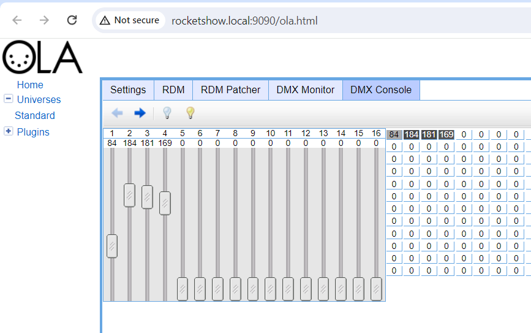

In this example I’m sending DMX information to the first 4 channels of this simple DMX light. The master dimmer (ch1=84), red (ch2=184), green (ch 3=181) and blue (ch4=169)

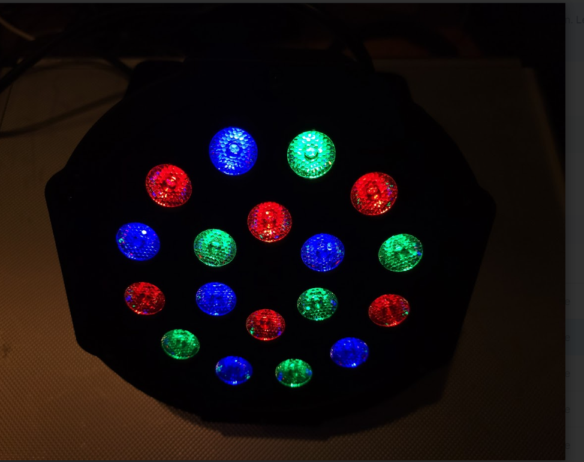

Note: any time you plug or unplug the DMX interface you need to reboot the Pi for the change to take effect.

### Verify Rocket Show can run video and sound with synchronized DMX lighting presets made in Rocket Show Designer (in 5 parts)

The simplest way to verify this function is to build a new composition using the default media included with Rocket Show. I will walk you through the process.

I won't go into every detail how Rocket Show Designer works for DMX lighting. It's too involved for this guide but I will create some simple examples and Moritz created a nice YouTube video showing how it works.  
[https://www.youtube.com/watch?v=zxEBDDMAimM](https://www.youtube.com/watch?v=zxEBDDMAimM)

And how to build your own fixture profiles  
[https://www.youtube.com/watch?v=c5n19GrXYfo](https://www.youtube.com/watch?v=c5n19GrXYfo)

Note: Configuring and using DMX lights is the most complex part of using Rocket Show. If you’re not familiar with using DMX I don’t recommend using this feature at all until you’ve acquired a working knowledge of DMX. In addition Rocket Show’s implementation of the Open Fixture Library profiles is not complete, so some profiles don’t work.  
If you’re just starting out I recommend buying a simple 7 channel RGB DMX Light like the one used in my example to train yourself on how to use the Designer.

### This inexpensive DMX light which has a 7 channel mode.
[Iverens Stage Lights](https://www.amazon.com/Iverens-Stage-Lights-Control-Lighting/dp/B0CKNY9Z75)

I picked this light because it is compatible with the first 4 channels of the LaluceNatz 18LEDs Par Light 7 channel mode fixture profile that is available in the Fixture pool. I will use this to create presets and scenes in my examples.

### Part 1: Go to the Composition tab and click "Create Composition"
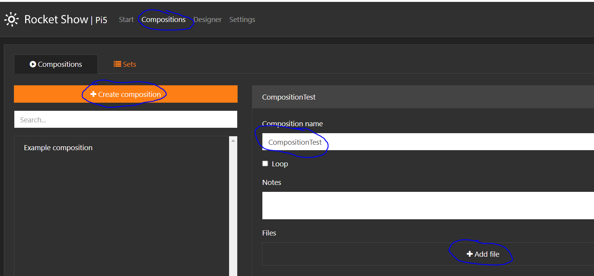

I named mine "CompositionTest"  
Click on "+ Add File"  
From the popup window click on Media Library.  
Select clouds.mp4 and click "OK"

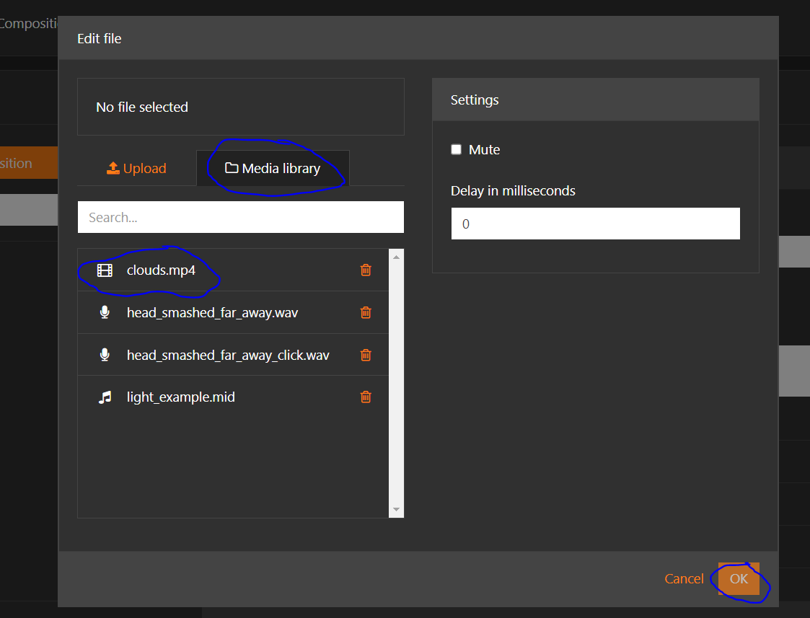

Click on "+ Add File"  
Select head_smashed_far_away.wav (The Audio Bus field should auto populate with "My audio bus 1" which you set up previously. Click OK

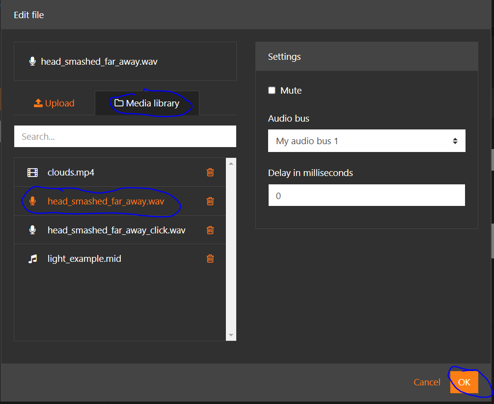

Click the "Save" button. Rocket Show will pop up a green window confirming you have saved the new DesignerTest composition.  
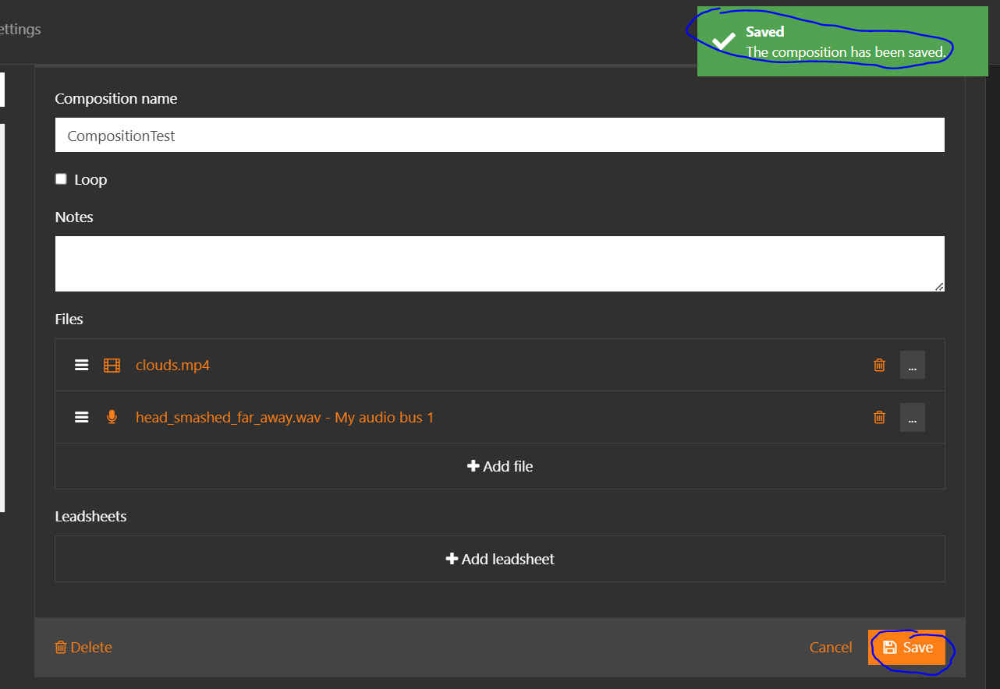

Go to the Start tab and you should see the new CompositionTest composition.  
Select the CompositionTest composition, click the play button icon to verify it plays correctly.  
You should see the cloud video and hear the audio track  
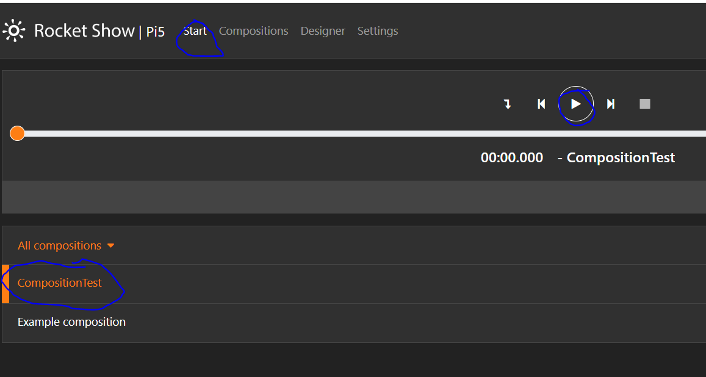

### Part 2: Enable Designer live preview
You need to enable Designer live preview so you can see your Designer presets respond to your changes.  
Note: This is not the same as the OLA DMX Console. You need this for Rocket Show Designer to synchronize your lights with the audio.

Go to Settings.Lighting and click the Enable checkbox for Designer live preview.  
Click the Save button  
Rocket Show pops up a green window verifying you have saved the settings.  
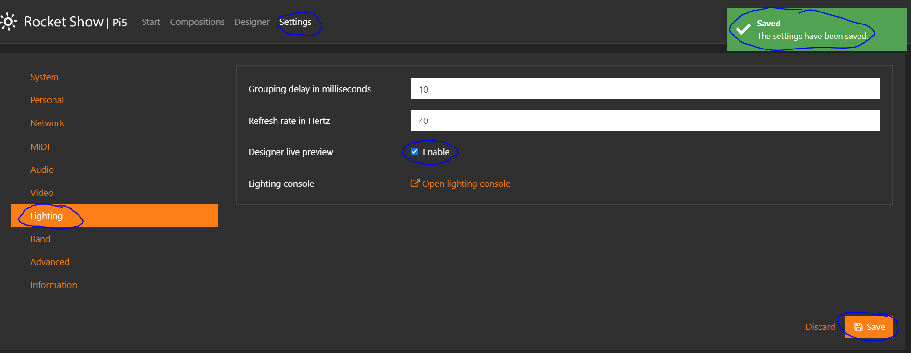

Reboot Pi for the changes to take place.

### Part 3: Go to the Designer tab to create new presets and scenes.

The Designer is where you create presets and scenes for your DMX lights. This feature requires the characteristics of your DMX light fixture to be defined as a profile in the Open Fixture Library or you will have to create your own custom profile. Rocket Show calls this library of profiles the Fixture Pool. When you select the proper profile from the fixture pool which matches your DMX light it should display the proper interface needed to create presets and scenes for each of your DMX lights. See Appendix D for more info on the Open Fixture Library. I recommend watching the youtube videos because it’s very likely you’ll need to create your own profiles.

Click on the Designer tab

**Important Note!!** Any time you click away from the Designer tab you WILL lose all of your work, so make sure you save your Designer Project frequently!

Go under Project dropdown and select New.  
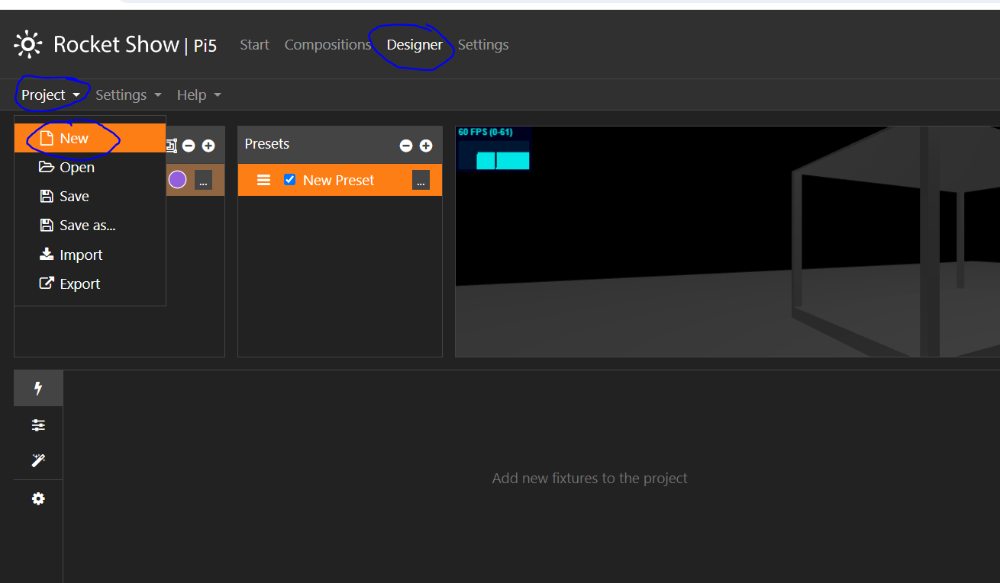

Save the new Designer project right away. Under Project dropdown select Save As. I named mine DMXTest.  
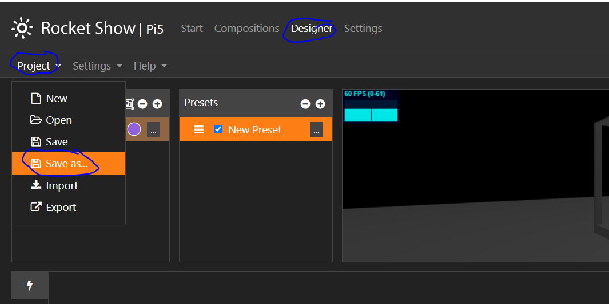

Note: Rocket Show doesn’t display the project name anywhere so you must remember the name of the current Project you’re working on.

Under Fixtures click on "Add new fixtures to the project" to call up the Fixture pool.  
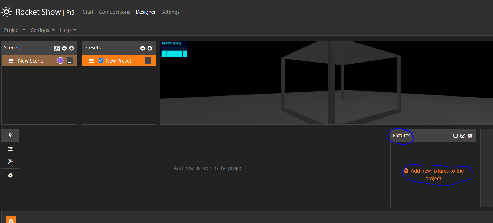

The Fixture pool screen is made up of the search area on the left, a listing of all your selected fixtures on the right.  
Below that is the DMX overview tab that shows a grid of the available 512 DMX channels. The Settings tab to the right shows the available settings for the select DMX light.

Here you can select a fixture from the Fixture pool or upload your own profile file by using the "+Create from profile file" button.  
In this example we’re going to use the search bar for the LaluceNatz - 18LEDs Par Light profile

From the Fixture pool click on the plus sign to the left of the name to load the fixture on to the DMX Overview.  
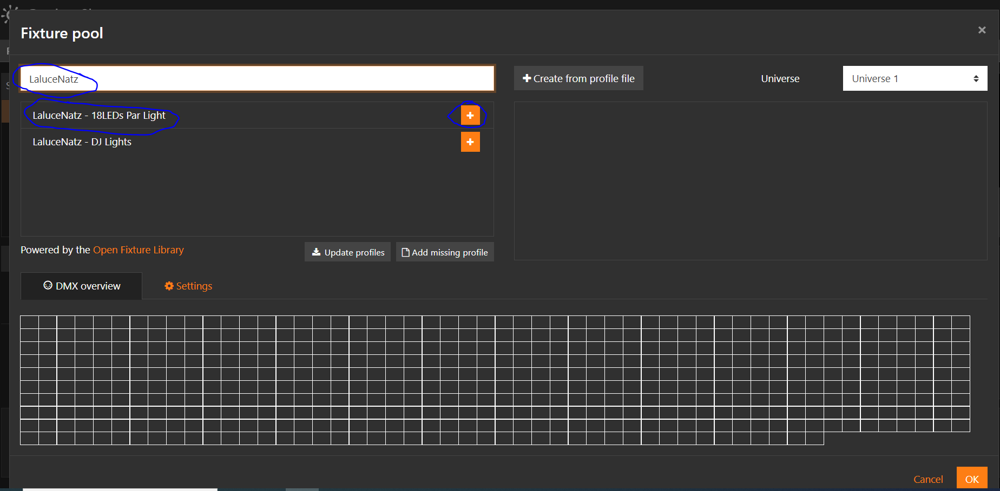

The LaluceNatz - 18LEDs Par Light is now listed in the right window. The orange blob represents the fixture's DMX addresses around the DMX Overview until it overlays with the correct DMX addressing. In this example Rocket Show assigned 4 channels of the LaluceNatz - 18LEDs Par Light to DMX channel 1 to 4  
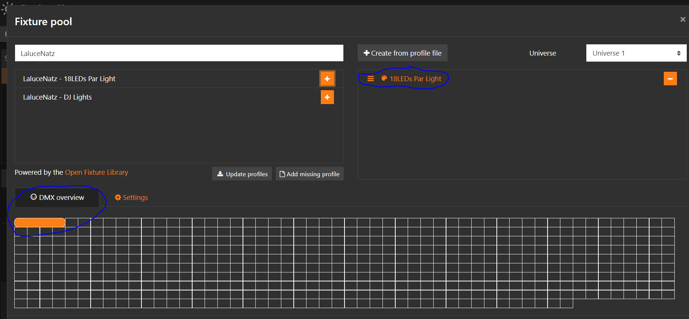

However we earlier set the LaluceNatz - 18LEDs Par Light to be in the 7 channel mode. To change to the 7 channel mode profile click on the Settings tab. In the Mode dropdown field select the 7 channel mode and click on the “OK” button.  
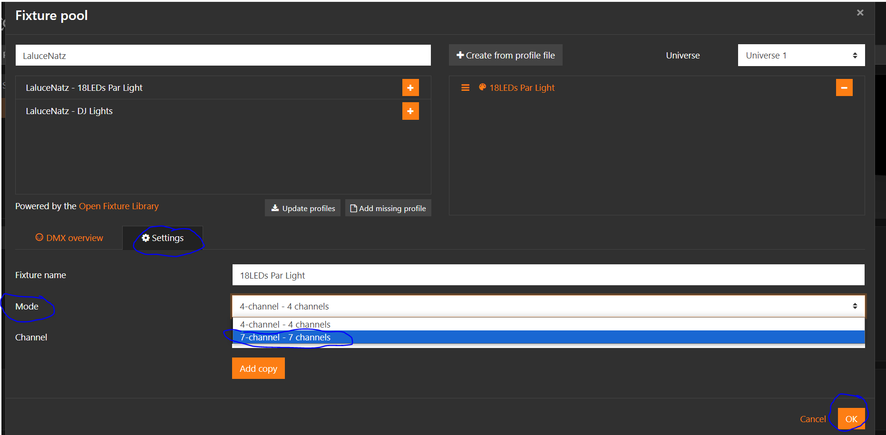

Clicking OK takes you back to the Designer. To verify you’re in the 7 channel mode, click on the Gear icon next to the Fixtures Area. This will take you back to the Fixture pool.  
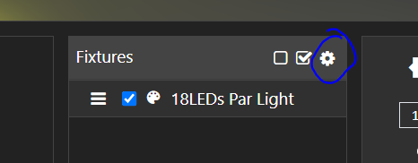

You can see the orange blob is now 7 channels long and is assigned to DMX channels 1 through 7. Click the OK button to go back to Designer  
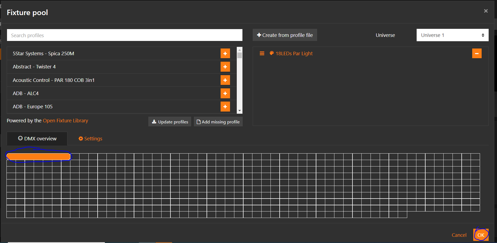

You should now see your fixture listed in the "Fixtures" box.  
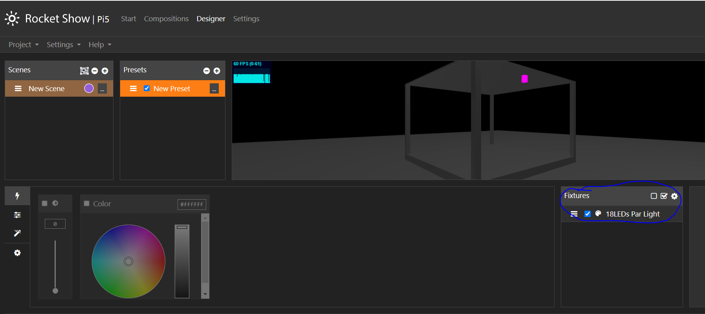

In the Designer area at the bottom left there are 4 icons which represent different display modes. Capabilities, Channels, Effects, Settings.  
In this example we’re going to be working in the Channels mode.  
Click on the Channels icon in the lower left side of the screen.  
This allows you to set the values for each of 7 DMX channels available for LaluceNatz - 18LEDs Par Light which is highlighted under Fixtures.  
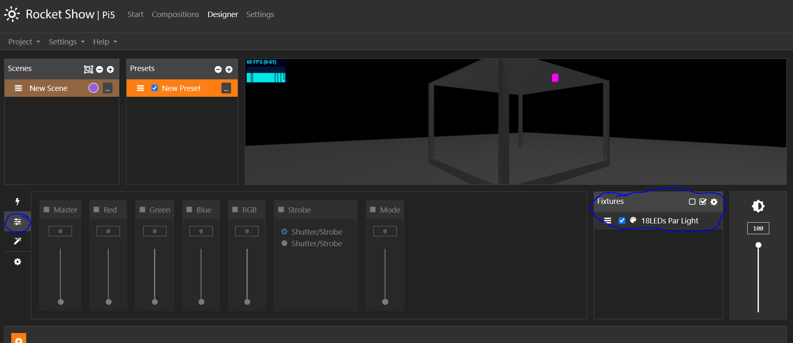

In this example we’re only going to be using the first 4 channels of the 18LEDs Par Light. To activate a channel you need to click on the checkbox next to the name i.e. Master, Red, Green, Blue, etc.  
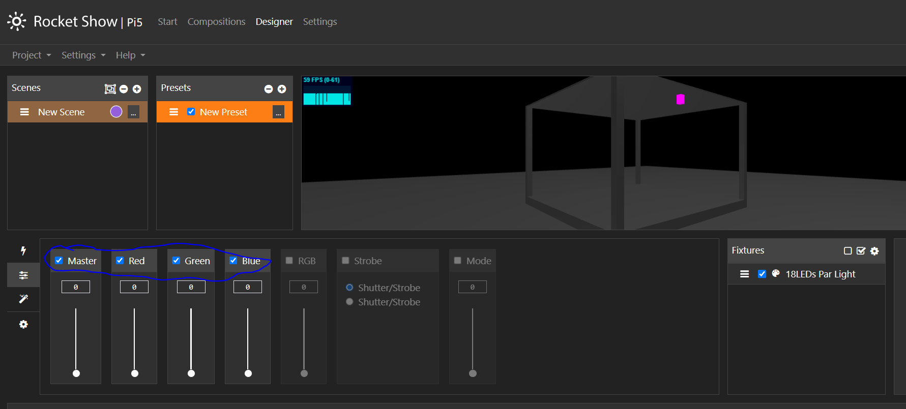

Since we enabled Designer live preview in Part 2, moving the Master and Red, Blue, and Green sliders will activate the LEDs on your connected 18LEDs Par Light.

You’re now ready to create new Presets and Scenes.  
In this example we’re going to create 3 new presets, one for each color red, blue, and green

Set the Master and Red sliders to 255 and deactivate the Green and Blue channels.  
Click on the 3 dots next to the “New Preset” name to call up a window to rename the preset.  
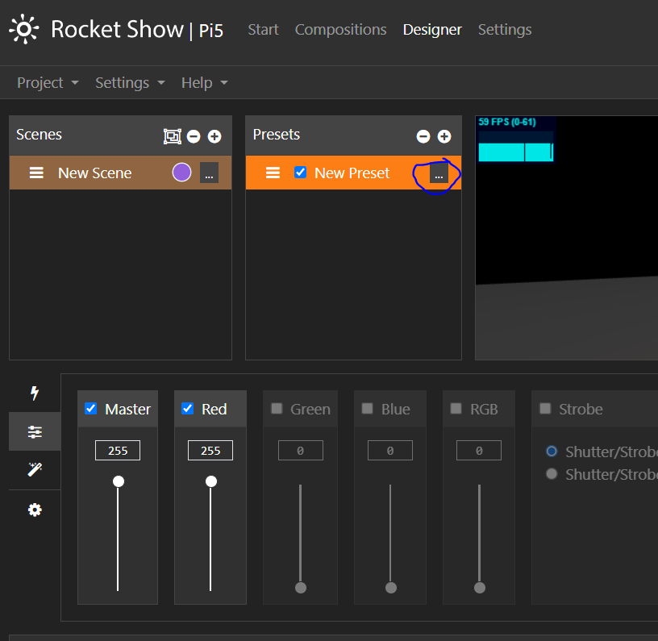

Rename the preset Red255 and click the OK button.  
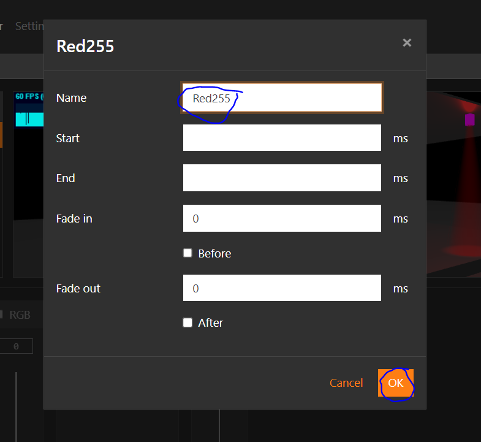

Click the + icon next to the Presets to create a new preset. You will notice that the 18LEDs Par Light is not selected.  


Select the 18LEDs Par Light and it will display the available channels again.  
Activate the Master and Green channels  
Set the Master and Green sliders to 255.  
Rename the preset Green255  
Repeat the process creating a new preset as above for the blue channel and name it Blue255  
Your Designer screen should look like this.  
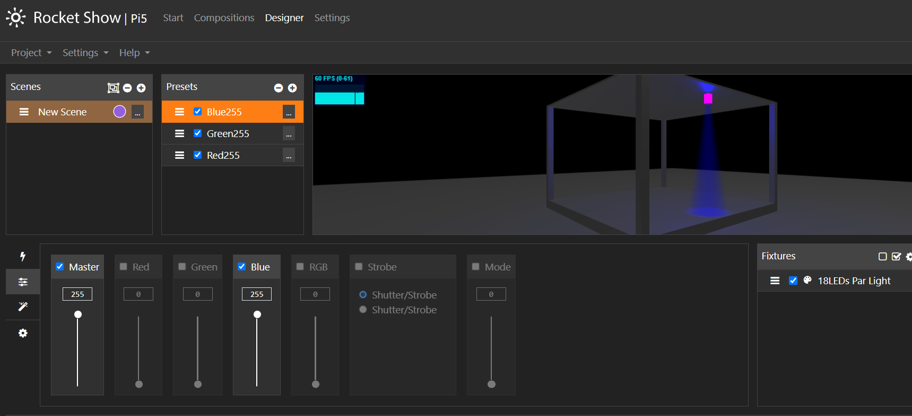

Now we are going to create 4 Scenes.  
If you click on the Scene “New Scene” you will see that all 3 presets are activated and all 3 colors are turned on.  
Click on the 3 dots next to the name New Scene. Rename this Scene “RGB Scene” and click the OK button  
  
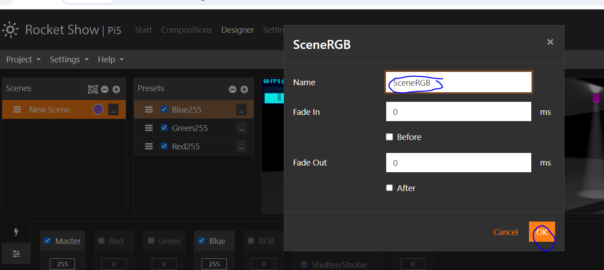

Create a new scene by clicking on the + icon next Scene area.  
You will notice the Par light connected to your USB interface will go dark and none of the presets are selected.  
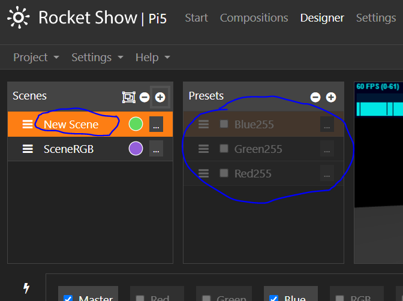

Click on presets Green255 and Blue255 to activate them for this new Scene. Rename this scene SceneGB  
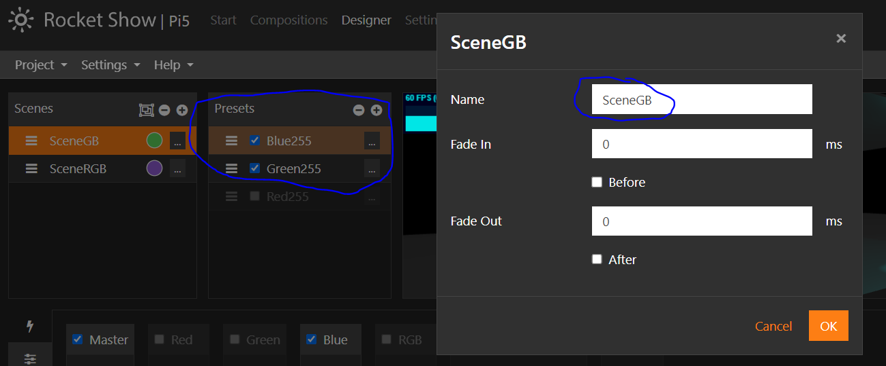

Repeat the process creating new scenes SceneRB and SceneRG.  
Your Designer project should look like this  
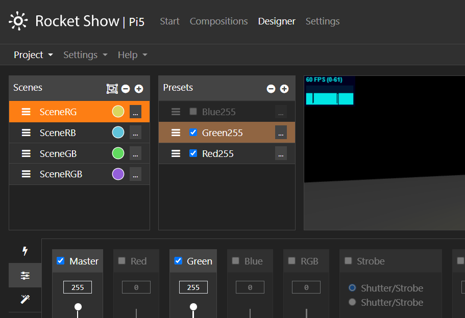

At this point you should save your work by going to Project tab and clicking Save  
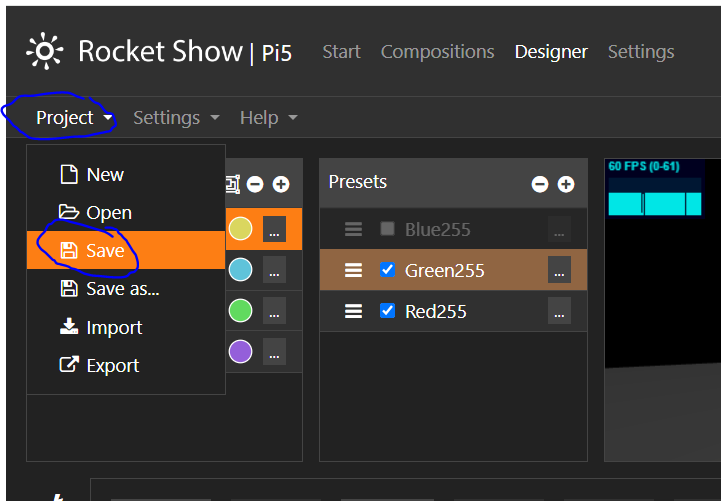

You’re now ready to link this Designer Project to the Composition you created earlier using audio sync.

### Part 4: Link the composition "CompositionTest" to lighting Designer Project "DMXTest" using audio sync.

Click on the "Create a composition to synchronize the scenes"  
In the window that pops up, type the first letter of the name you gave the composition earlier in the Name field.  
In this example it's CompositionTest.  
(Once you enter the letter C the autocomplete will show you the name CompositionTest for you to select)  
Leave the Synchronization field as the default "Audio file"  
Click on the Media Library the file “head_smashed_far_away.wav” and Click OK.  
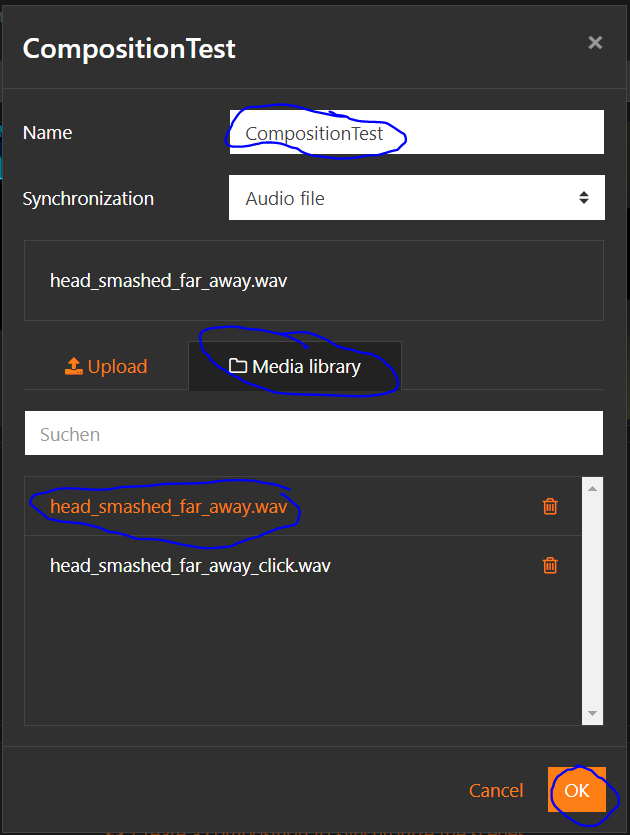

Rocket Show Designer will show the audio for the file head_smashed_far_away.wav on a timeline.  
Note: Depending on your screen size you may have the drag the handle for timeline up so you can see the waveform.  
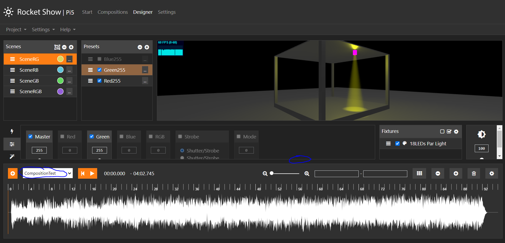

Click on a Scene above and with your mouse use click and drag to draw the Scene's start and end points directly on the timeline.  
With the mouse you can also modify the start/stop times and drag it around the timeline. Each scene is assigned a color to make it easier to see on the timeline  
Repeat until you have drawn all the Scenes in the timeline. In my example I drew all 4 scenes on the timeline.

You can now preview this composition with the Play button and verify all the Scenes play correctly on the timeline and send the DMX information to the 18LEDs Par Light.

Note: The audio will play from your remote PC, not the Pi.

If the 18LEDs Par Light is not getting the DMX information I save the project and reboot the PI. This fixes the issue.  
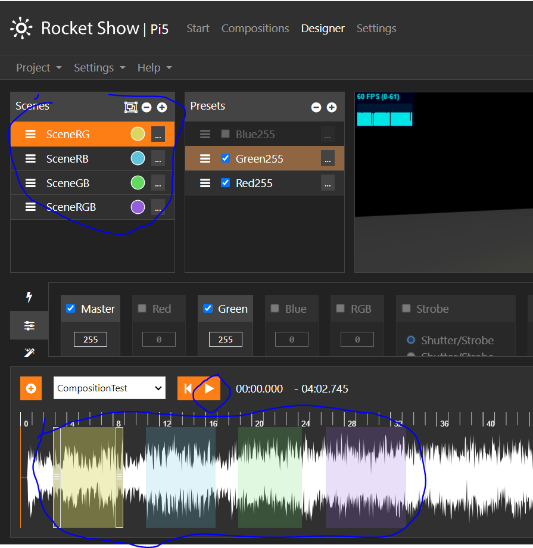

When finished save the project using the Project dropdown and selecting Save.  
Rocket Show pops up a green window confirming the Designer project has been saved.  
I normally recall the Designer Project just to verify it has been saved.

### Part 5: Play the composition to verify the DMX lighting Designer Project "DMXTest" is now synchronized with audio and video Composition "CompositionTest"

Go to the Start tab  
Select the synced composition. In this example it's named "CompositionTest".  
Click the Play button.  
The lighting presets should now be synced with the audio and video.  
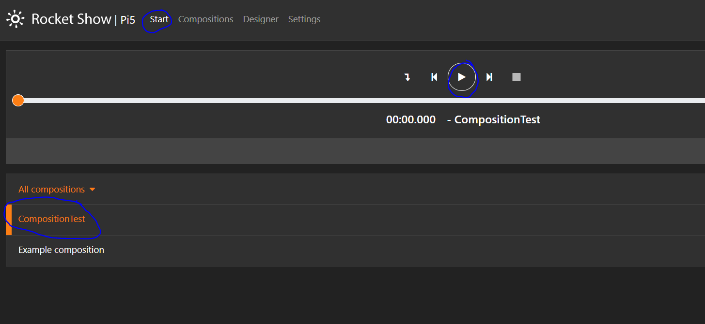

You have now verified Rocket Show can run video and sound with audio synchronized lighting presets made in Rocket Show Designer.

### Other useful settings

#### Setting the Default composition
If you want a composition to play any time Rocket Show starts or when you're not playing another composition.  
Go to the Start tab in the System section to the field Default composition.  
Click in the field box and it will give a dropdown menu of all the compositions you can choose for the Default composition.  
Choose a composition and click Save  
Reboot the Pi for the changes to take effect.  
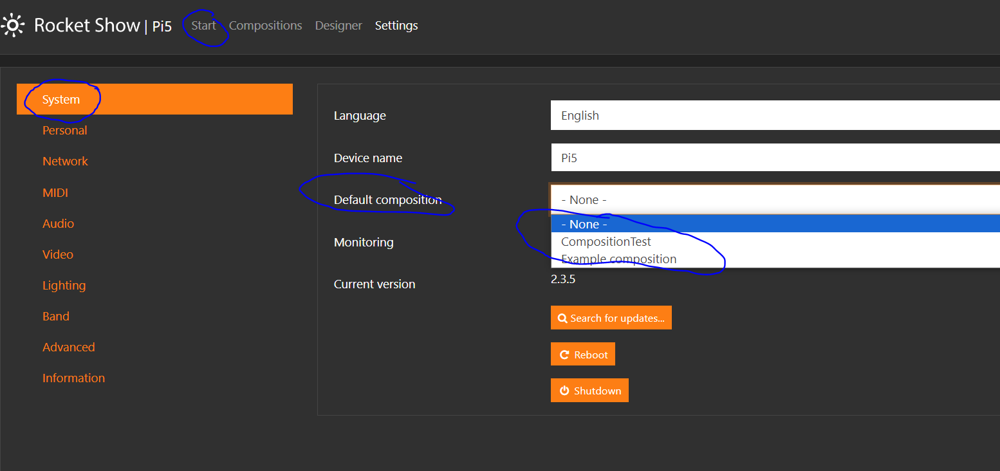

### Conclusion
That's It! That's as far as I got with the features of Rocket Show.  
Once I figure out any more features I'll update this document.

Thanks for reading. I hope this helps you.  
DavidOpgh

### Appendix A: My Gear
- Raspberry Pi 4 8GB
- Case [https://www.amazon.com/Argon-Raspberry-Aluminum-Heatsink-Supports/dp/B07WP8WC3V](https://www.amazon.com/Argon-Raspberry-Aluminum-Heatsink-Supports/dp/B07WP8WC3V)
- Power supply [https://www.amazon.com/gp/product/B094J8TK61](https://www.amazon.com/gp/product/B094J8TK61)
- Raspberry Pi 5 8GB [https://www.amazon.com/dp/B0CRSNCJ6Y?psc=1&ref=ppx_yo2ov_dt_b_product_details](https://www.amazon.com/dp/B0CRSNCJ6Y?psc=1&ref=ppx_yo2ov_dt_b_product_details)
- Case [https://www.amazon.com/gp/product/B0CNGSXGT2/ref=ppx_yo_dt_b_asin_title_o01_s00?ie=UTF8&psc=1](https://www.amazon.com/gp/product/B0CNGSXGT2/ref=ppx_yo_dt_b_asin_title_o01_s00?ie=UTF8&psc=1)
- HDMI Monitor 1 - For playing videos
- HDMI Monitor 2 - terminal console display
- Powered USB Hub - not absolutely necessary but I highly recommend it until you know your setup is working  
  [https://www.amazon.com/gp/product/B07MQDJLSF](https://www.amazon.com/gp/product/B07MQDJLSF)
- Network cable plugged into home or local internet
- USB audio device - I'm using this [https://www.amazon.com/gp/product/B07RV6VBNR](https://www.amazon.com/gp/product/B07RV6VBNR)
- USB DMX Interface - I'm using the ENTTEC Open DMX USB [https://www.amazon.com/gp/product/B00O9RY664](https://www.amazon.com/gp/product/B00O9RY664)
- Simple 7 channel DMX RGB Light - used for testing. Something like this. [https://www.amazon.com/Iverens-Stage-Lights-Control-Lighting/dp/B0CKNY9Z75](https://www.amazon.com/Iverens-Stage-Lights-Control-Lighting/dp/B0CKNY9Z75)
- USB keyboard and mouse - I'm using this [https://www.amazon.com/Logitech-Wireless-Keyboard-Mouse-Combo/dp/B07SD98VP7](https://www.amazon.com/Logitech-Wireless-Keyboard-Mouse-Combo/dp/B07SD98VP7)
- PC laptop connected to home or local internet with network cable

### Appendix B - Enable/Disable OLA plugins
**Note**: If you have a USB keyboard connected to your Pi you can enable/disable OLA plugins through the keyboard after logging in locally to Rocket Show on the Pi.

The current configuration of the Open Lighting Architecture (OLA) used by Rocket Show has the required plugins disabled for the most common of DMX USB interfaces.  
If you bought a ENTTEC OPEN DMX USB interface (which I consider as the standard) or some other cheap FTDI USB DMX interface like this one  
[https://www.amazon.com/dp/B07D6LNXF9](https://www.amazon.com/dp/B07D6LNXF9)  
when you initially boot up Rocket Show it won't see these USB DMX interfaces and your DMX lights won't work.

You need to disable 3 OLA plugins and enable 1 OLA plugin for interfaces like these to work. This is required because some plugins conflict with other plugins.  
Here is the command used enable/disable OLA plugins  
ola_plugin_state - Get and set the state of the plugins loaded by olad.

#### SYNOPSIS
`ola_plugin_state --plugin-id [--state <enable|disable>]`

#### DESCRIPTION
`ola_plugin_state` is used to get and set the enabled/disabled state for a plugin and the list of plugins this plugin will conflict with.

#### OPTIONS
- `-h, --help`  
  Display the help message
- `-p, --plugin-id <plugin_id>`  
  Id of the plugin to fetch the state of.
- `-s, --state <enable|disable>`  
  State to set a plugin to.

These are the 3 plugins that need disabled.  
(They need to be disabled because they conflict with the plugin we need.)

**Plugin StageProfi**  
Id=8

**Plugin Enttec Open DMX**  
Id=6 (Yes, I know it's surprising that this plugin doesn't work with the ENTTEC OPEN DMX USB interface)

**Plugin Serial USB**  
Id=5

To disable these plugins type in these commands
```shell
ola_plugin_state -p8 -sdisable
ola_plugin_state -p6 -sdisable
ola_plugin_state -p5 -sdisable
```

This is the 1 plugin that needs enabled  
**Plugin FTDI USB DMX**  
Id=13

To enable this plugins type in this command  

```shell
ola_plugin_state -p13 -senable
```


**Note**: If you need to find the id of a plugin  
There might be an easier way but this is how I did it.  
You can do this after Rocket Show is up and running.  
Go to the OLA Admin browser tab page in your browser
rocketshow.local:9090/ola.html
Click on plugin name located in the column on the left side
Click the "View Log" link located in upper right corner of the page
Look for a recent entry in log for the command
Sending request [GET json/plugin_info?id=XX where XX will be the Id of the plugin you clicked on.

## Appendix C - Designer Preset and Scene Parameters

### Preset Parameters
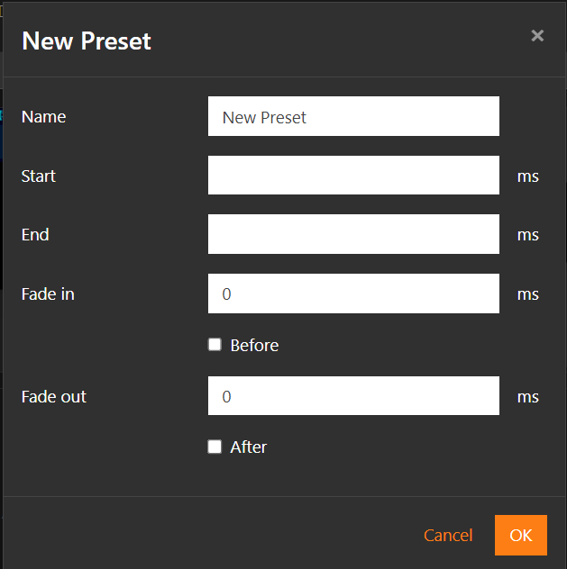
- **Name**: Gives a preset a unique name
- **Start**: Defines where a preset will start within a scene
- **End**: Defines where a preset will end within a scene
- **Fade in**: Defines when a preset will start to linearly fade in from the beginning of the preset
- **Before**: If checked, defines when a preset will start to linearly fade in before the beginning of the preset
- **Fade out**: Defines when a preset will start to linearly fade out before the end of the preset
- **After**: If checked, defines how long a preset will linearly fade out after the end of the preset

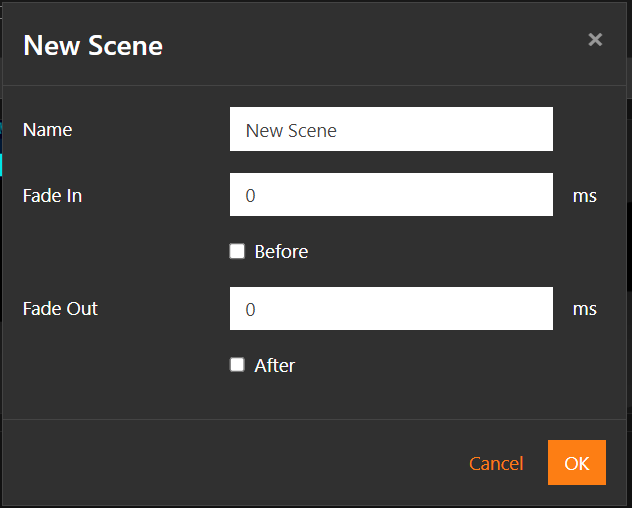

### Scene Parameters
- **Name**: Gives a scene a unique name
- **Fade in**: Defines when a scene will start to linearly fade in from the beginning of the scene
- **Before**: If checked, defines when a scene will start to linearly fade in before the beginning of the scene
- **Fade out**: Defines when a scene will start to linearly fade out before the end of the scene
- **After**: If checked, defines how long a scene will linearly fade out after the end of the scene

## Appendix D - Open Fixture Library

The Open Fixture Library (OFL) used by Rocket Show is a static snapshot of the online library. The library of fixtures does not get regularly updated by Rocket Show. So if you submit new fixture profiles online to the OFL, Rocket Show won’t pick them up until Moritz updates Rocket Show’s OFL local database.

If OFL has a fixture but Rocket Show does not have it, you can download the JSON file from the OFL and import it into Rocket Show. But make sure you thoroughly test these downloaded profiles. OFL has a programming language with different functions used by some profiles, but Rocket Show does not recognize them. I’ve come across profiles that won't work in Rocket Show, so I had to make my own.

Any fixture you create or download will have to be imported to every Designer project you make since they’re not incorporated into Rocket Show’s local snapshot of the OFL.

At some point, you’ll most likely need to build your own fixture profiles if they’re not already in the fixture library. It’s best to keep your profiles simple.

Here is Moritz’s video to get you started using the online fixture editor:
[https://www.youtube.com/watch?v=c5n19GrXYfo](https://www.youtube.com/watch?v=c5n19GrXYfo)

Here is the link to the fixture editor:
[https://open-fixture-library.org/fixture-editor](https://open-fixture-library.org/fixture-editor)

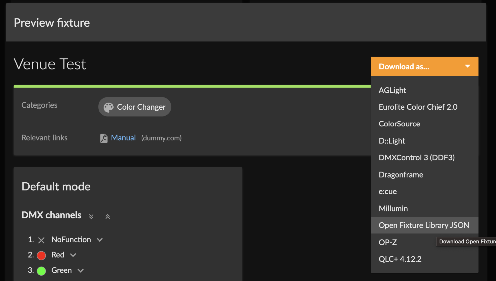

If you do create fixture profiles using the online editor, you need to click "create fixture" -> "preview fixture" and then there's a download button for all formats:
This is the step before submitting it to the OFL.

You download the format Open Fixture Library JSON if you want to import it into Rocket Show.

I’ve created my own fixture profiles. You can use an existing profile as a template. In practice, it’s best to create simple profiles with a slider for each channel.
